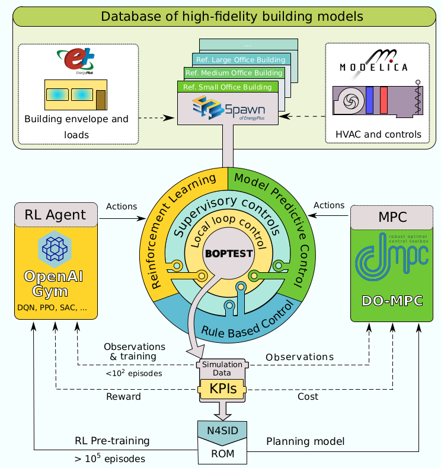
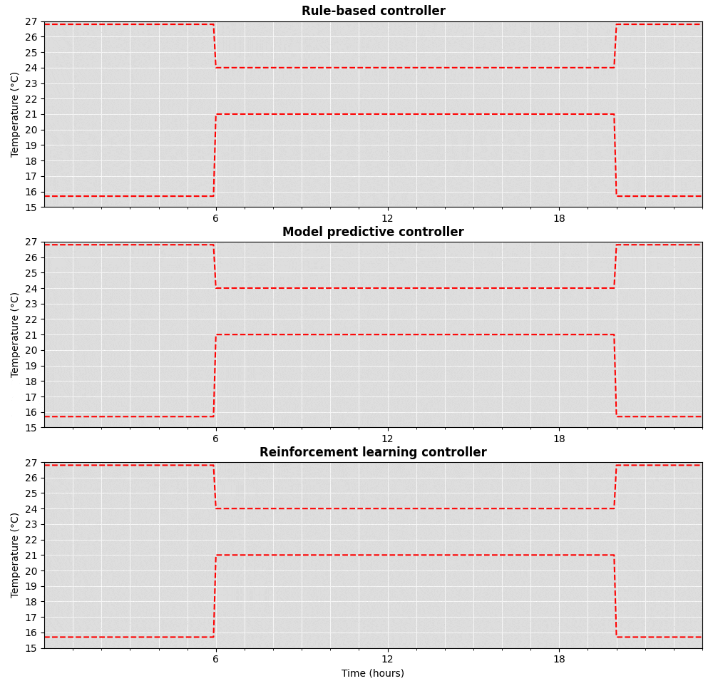

# Advanced Controls Test Bed

The Advanced Controls Test Bed (ACTB) is a virtual buildings test bed that interfaces external controllers to high-fidelity Spawn of EnergyPlus models. 
The ACTB has two interfaces to Python control libraries:
- one interface for model predictive controllers (MPC) based on [do-mpc](https://www.do-mpc.com/en/latest/)
- one interface for reinforcement learning controllers (RLC) based on [OpenAI Gym](https://gym.openai.com/)

[Spawn of EnergyPlus](https://www.energy.gov/eere/buildings/downloads/spawn-energyplus-spawn) is a model-exchange framework that allows the simulation of building envelope and internal gains models in EnergyPlus, and their HVAC systems and controls in Modelica.

This makes the ACTB a flexible and user-friendly framework for developing and evaluating advanced controls using high-fidelity building models.

The ACTB is based on the BOPTEST framework available [here](https://github.com/ibpsa/project1-boptest) and the [BOPTEST OpenAI Gym interface](https://github.com/ibpsa/project1-boptest-gym).

The ACTB is currently in its first release version and might undergo changes, contain broken modules, or function unexpectedly. Please report all issues in the Issues tab at the top of the page.

## Architecture

The ACTB is based on BOPTEST-service, a merge between BOPTEST and [Alfalfa](https://github.com/NREL/alfalfa). It is supplemented by a library of high-fidelity Spawn models and two advanced controller interfaces. A metamodeling framework allows the generation of reduced order models from Spawn data, in order to provide computationally-efficient models for MPC planning models and RLC pre-training (see the RLC guide [here](TODO)).

## Interfaces

Two advanced controller interfaces are currently available for the ACTB.
- the do-mpc interface for MPC is available under ``/interfaces/dompc``, along with a ReadMe file and examples of applications. It is used by the MPC example found in ``/examples/python/MPC-spawnrefsmalloffice``.
- the OpenAI Gym interface for RLC is available under ``/interfaces/openai-gym``, along with a ReadMe file and examples of applications. It is used by the RLC example found in ``/examples/python/RLC-spawnrefsmalloffice``

## Test cases

Testcases are found in the ``/testcases`` directory. Example controllers to go with these test cases are found under the ``/examples`` directory.

For the moment, one Spawn test case is available. It represents the U.S. Department of Energy's Small Office Building.
It is provided with a documentation, found under ``/testcases/spawnrefsmalloffice/docs``.

## Quick-Start to Run Test Cases
1) Install [Docker](https://docs.docker.com/get-docker/).
2) Build the test case by ``$ make build TESTCASE=<testcase_dir_name>`` where <testcase_dir_name> is the name of the test case subdirectory located in ``/testcases``.
3) Deploy the test case by ``$ make run TESTCASE=<testcase_dir_name>`` where <testcase_dir_name> is the name of the test case subdirectory located in ``/testcases``.
4) Run an example test controller:

  * Add the root directory of the BOPTEST repository to the PYTHONPATH environment variable.
  * Build and deploy ``spawnrefsmalloffice``.  Then, in a separate terminal, use ``$ cd examples/python/MPC-spawnrefsmalloffice && python main.py`` to test a MPC controller.
  * Build and deploy ``spawnrefsmalloffice``.  Then, in a separate terminal, use ``$ cd examples/python/RLC-spawnrefsmalloffice && python main.py`` to test a RLC controller.
  * Build and deploy ``spawnrefsmalloffice``.  Then, in a separate terminal, use ``$ cd examples/python/RBC-spawnrefsmalloffice && python noOverride.py`` to test the RBC controller built into the Spawn test case.
 
6) Shutdown a test case container by selecting the container terminal window, ``Ctrl+C`` to close port, and ``Ctrl+D`` to exit the Docker container.
7) Remove the test case Docker image by ``$ make remove-image TESTCASE=<testcase_dir_name>``.

## Windows Users

The ACTB runs on UNIX operating systems, but an additional software layer is currently necessary for Windows users.
Please install the Windows Subsystem for Linux (WSL) by following the instructions [here](https://docs.microsoft.com/en-us/windows/wsl/install).
You will simply need to start an instance of the WSL first, then run the commands found in the various instructions of this repository in the Linux terminal
that will be launched.

## Known Issues

Currently, the ACTB has some issues that we are aware of and are working towards solving. These are:
- the metamodeling framework produces models which temperature prediction is shifted by approximately 20 K.

## Structure
- ``/testcases`` contains Spawn of EnergyPlus test cases, including docs, models, and configuration settings.
- ``/examples`` contains examples of MPC and RLC Python controllers that interact with Spawn models.
- ``/interfaces`` contains the clients for interfacing do-mpc and OpenAI Gym to the ACTB
- ``/metamodeling`` contains prototype code for the metamodeling framework
- ``/parsing`` contains prototype code for a script that parses a Modelica model using signal exchange blocks and outputs a wrapper FMU and KPI json.
- ``/template`` contains template Modelica code for a test case emulator model.
- ``/testing`` contains code for unit and functional testing of this software.  See the README there for more information about running these tests.
- ``/data`` contains prototype code for generating and managing data associated with test cases.  This includes boundary conditions, such as weather, schedules, and energy prices, as well as a map of test case FMU outputs needed to calculate KPIs.
- ``/forecast`` contains prototype code for returning boundary condition forecast, such as weather, schedules, and energy prices.
- ``/kpis`` contains prototype code for calculating key performance indicators.
- ``/docs`` contains design requirements and guide documentation.

## Acknowledgements
We gratefully acknowledge funding by the U.S. Department of Energy under Project 3.2.6.80, titled _Multi-Objective Deep Reinforcement Learning Controls_.

To develop the ACTB, we rely on the following software:
- the [Buildings Operation Performance TEST](https://github.com/ibpsa/project1-boptest), developed under IBPSA Project 1
- the [BOPTEST OpenAI Gym interface](https://github.com/ibpsa/project1-boptest-gym), developed under IBPSA Project 1
- [Spawn of EnergyPlus](https://www.energy.gov/eere/buildings/downloads/spawn-energyplus-spawn)
- the [System Identification Package for Python](https://github.com/CPCLAB-UNIPI/SIPPY.git)
- the [do-mpc](https://www.do-mpc.com/en/latest/) package
- the [OpenAI Gym](https://gym.openai.com/) package

## Authors
This project is led by Professor Gregor Henze, at the University of Colorado Boulder.
It is developed and maintained by Dr. Thibault Marzullo, Sourav Dey, and Nicholas Long, at the University of Colorado Boulder.

Former project members:
- Developer (2021-2021): José Angel Leiva Vilaplana, Masters candidate, Universitat Politecnica de Catalunya.
